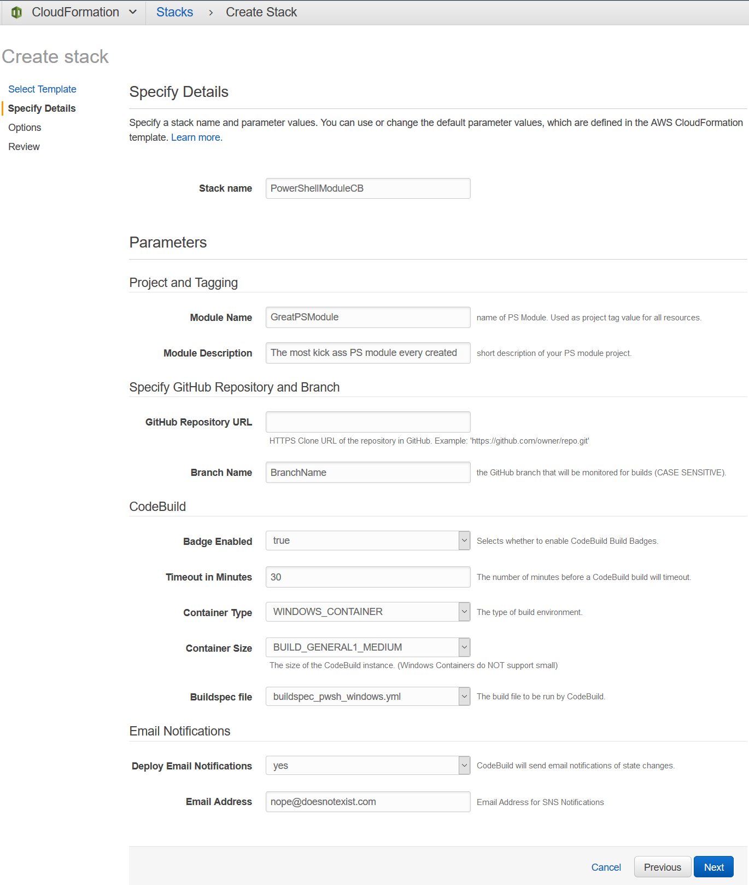

# AWSCBManifestPS


[](https://github.com/PowerShell/PowerShell)

## Synopsis

Scaffolds a new PowerShell module project intended for CI/CD workflow using [AWS CodeBuild](https://aws.amazon.com/codebuild/).

## Description

This is a custom Plaster manifest template that can be invoked using the Plaster module. It can rapidly generate a PowerShell module project for use with AWS CodeBuild.

The build process is based around InvokeBuild which will perform a variety of tasks to test, create and structure help/docs for your module, and build your module for publication.

This template will prompt with a few options and will then perform the following:

* Builds PowerShell module layout based on best community practices
* Adds pre-populated .gitignore file
* Adds specified builspec file(s) for AWS CodeBuild
* Creates helpful .vscode settings and tasks
* Creates all needed build files for CodeBuild container
  * Configures AWS Credentials
  * Install needed modules for build process
  * All build files are made layout aware
* Creates basic Pester test structure with several basic tests
* Creates CloudFormation templates that you can use to quickly create a stack for your build process
* Creates github community files such as: Code of Conduct, Contributing, License, Changelog, and Issues + PR templates
* Creates PSScriptAnalyzer settings file that can be used to analyze your code and enforce PowerShell code styling


This template currently supports two repository sources that the user can specify when invoking the template:

* [GitHub](https://github.com/)
* [AWS CodeCommit](https://aws.amazon.com/codecommit/)

## Why

Simplify the process of structuring your module and including components to enable it to build with AWS CodeBuild.

Rapidly scaffold module layout, required build files, and CloudFormation templates so that you can focus on building a great PowerShell module instead of the build process.

## Installation

### Prerequisites

* PowerShell 5.1/6.1+
* [Plaster](https://github.com/PowerShell/Plaster) ```powershell Install-Module Plaster -Scope CurrentUser```

* [platyPS](https://github.com/PowerShell/platyPS) ```powershell Install-Module -Name platyPS -RequiredVersion 0.12.0 -Scope CurrentUser```

* [Invoke-Build](https://github.com/nightroman/Invoke-Build) ```powershell Install-Module InvokeBuild```

* [Pester](https://github.com/pester/Pester) ```powershell Install-Module -Name Pester -Force```

* [Create and activate an Amazon Web Services account](https://aws.amazon.com/premiumsupport/knowledge-center/create-and-activate-aws-account/)

### Install AWSCBManifestPS

1. Download repository/release and unzip to desired location.
2. Reference previous location when plastering new PowerShell projects

## Quick start

```powershell
Invoke-Plaster -TemplatePath C:\test\AWSCBManifestPS\ -DestinationPath C:\Test\GreatPSModule\
```

```
  ____  _           _
 |  _ \| | __ _ ___| |_ ___ _ __
 | |_) | |/ _` / __| __/ _ \ '__|
 |  __/| | (_| \__ \ ||  __/ |
 |_|   |_|\__,_|___/\__\___|_|
                                            v1.1.3
==================================================
Enter the name of the module: GreatPSModule
Enter the version number of the module (0.0.1):
Enter your full name (First Last):
Where will this project be hosted?
[G] GitHub  [A] AWS CodeCommit  [?] Help (default is "G"):
Would you like to generate a Changelog file?
[C] Changelog  [N] None  [?] Help (default is "C"):
Select a License for your module. (Help deciding: https://choosealicense.com/)
[M] MIT  [A] Apache  [G] GNU  [I] ISC  [N] None  [?] Help (default is "M"):
Would you like to generate a Code of Conduct file?
[C] conduct  [N] None  [?] Help (default is "C"):
Would you like to generate a Contributing guidelines file?
[C] Contribute  [N] None  [?] Help (default is "C"):
Would you like to specify a coding style for the project?
[S] Stroustrup  [O] OTBS  [A] Allman  [N] None  [?] Help (default is "S"):
Enter S3 bucket name to download needed PS modules from S3 location. Leave blank to DL modules from PSGallery. (PSGallery):
Select desired buildpsec file options?
[W] Windows - PowerShell
[C] Core (Windows)- pwsh
[L] Linux - pwsh
[N] None
[?] Help
(default choices are W,C,L)
Choice[0]:
Destination path: C:\rs-pkgs\test\plastertest\

Scaffolding your PowerShell Module for AWS CodeBuild...

   Create docs\
   Create media\
   Create src\
   Create CloudFormation\
   Create src\Archive\
   Create src\Artifacts\
   Create src\Tests\
   Create src\Tests\Infrastrcuture\
   Create src\Tests\Unit\
   Create src\GreatPSModule\
   Create src\GreatPSModule\Public\
   Create src\GreatPSModule\Private\
   Create .vscode\tasks.json
   Create .vscode\extensions.json
   Create .vscode\settings.json
   Create src\Tests\Unit\GreatPSModule-Module.Tests.ps1
   Create src\Tests\Unit\ExportedFunctions.Tests.ps1
   Create src\Tests\Unit\GreatPSModule-Function.Tests.ps1
   Create src\GreatPSModule.build.ps1
   Create src\GreatPSModule.Settings.ps1
   Create src\PSScriptAnalyzerSettings.psd1
   Create configure_aws_credential.ps1
   Create CloudFormation\S3BucketsForPowerShellDevelopment.yml
   Create .gitignore
   Create .github\CHANGELOG.md
   Create .github\LICENSE.txt
   Create .github\CODE_OF_CONDUCT.md
   Create .github\CONTRIBUTING.md
   Create .github\PULL_REQUEST_TEMPLATE.md
   Create .github\ISSUE_TEMPLATE\bug-report-or-feature-request.md
   Create buildspec_powershell_windows.yml
   Create buildspec_pwsh_windows.yml
   Create buildspec_pwsh_linux.yml
   Create install_modules.ps1
   Create CloudFormation\PowerShellCodeBuildGit.yml
   Create src\GreatPSModule\GreatPSModule.psd1
   Create src\GreatPSModule\GreatPSModule.psm1
   Verify The required module Pester (minimum version: 4.7.2) is already installed.
   Verify The required module InvokeBuild (minimum version: 5.4.2) is already installed.
   Verify The required module platyPS (required version: 0.12.0) is already installed.

Your new PowerShell module project 'GreatPSModule' has been created.

Several Pester tests have been created to validate various components of the module.  Add additional tests to the test directory.
You can run the Pester tests in your project by executing the 'test' task.  Press Ctrl+P, then type 'task test'.

CloudFormation files have been generated for this project. You can find these in the CloudFormation folder.
You can login to your AWS account and utilize these file to quickly create a stack for your project build.
```

## Getting Started

*Note: Before getting started you should have a basic idea of what you expect your module to support. That decision will determine which builds you should run:*

| Windows PowerShell  | Windows pwsh | Linux pwsh |
| ------------- | ------------- | ------------- |

1. Invoke the template by specifying the location of the template, as well as the destination of where you'd like to create your new module.

    ```powershell
    Invoke-Plaster -TemplatePath C:\test\AWSCBManifestPS\ -DestinationPath C:\Test\GreatPSModule\
    ```

    * In the above example the template files are located in ```C:\test\AWSCBManifestPS\``` and the module will be built at ```C:\Test\GreatPSModule\```

2. The Plaster logo will be displayed and you will see your first prompt: **Where will this project be hosted?** This selection influences which *CloudFormation file* is generated. Select based on where you intend to store your code, GitHub or AWS CodeCommit.

   * *NOTE: If you choose GitHub you will need to first associate your AWS account with your GitHub account (if you have never done so). See the NOTES section of this README for details.*

3. **Would you like to generate a Changelog file?**

4. **Select a License for your module. (Help deciding: https://choosealicense.com/)**

5. **Would you like to generate a Code of Conduct file?**

6. **Would you like to generate a Contributing guidelines file?**

7. **Would you like to specify a coding style for the project?**
[S] Stroustrup  [O] OTBS  [A] Allman  [N] None  [?] Help (default is "S"):

8. **Enter S3 bucket name to download needed PS modules from S3 location. Leave blank to DL modules from PSGallery.** Your CodeBuild instance will need various modules to successfully build your PowerShell module project. By default, it does not contain them. Leaving this blank will default to having the CodeBuild instance download and install the needed modules from the PSGallery during each build. You can improve build times and performance by instead loading the required modules into an S3 bucket. If you choose to do so, you can specify the S3 bucket here. Don't forget to give your CodeBuild project permission to that S3 bucket.

9. **Select desired buildpsec file(s) options?** This is the most important selection and determines which buildspec files are generated for the CodeBuild. You need to consider what platforms you intend for your module to support. One, or all of these can be specified. The following scenarios are possible:

    | Buildspec | Environment | PowerShell |
    | ------------- | ------------- | ------------- |
    | buildspec_powershell_windows.yml  | WINDOWS_CONTAINER  | powershell  |
    | buildspec_pwsh_windows.yml  | WINDOWS_CONTAINER  | pwsh (1) |
    | buildspec_pwsh_linux.yml  | LINUX_CONTAINER  | pwsh  |

    *(1)PowerShell 6.1.3 will be downloaded, installed, and all build tasks will run under the context of pwsh*

10. Create your CodeBuild project in your AWS account. You can do this manually, or use the generated CloudFormation template (recommended).

    * **GitHub**
      * The generated CFN template will guide you through the process. You will need a SEPERATE CodeBuild for each build type. So, if you wanted to build against all three platforms, you would deploy the template three times, specifying the desired buildspec for each stack deployment.
      * The following shows the GitHub CFN example: 
      * The GitHub process is not currently configured to generate artifacts. You are welcome to make adjustments to include them.
    * *Don't forget to copy your badge URL to display on your project*
    * **CodeCommit**
      * The CodeCommit does include artifacts. Use the **S3BucketsForPowerShellDevelopment.yml** to quickly create the S3 bucket stack needed to store them.
      * The generated CFN template will guide you through the process. This CFN is different than the GitHub one in that you only need to deploy it once. This CFN will be dynamically altered based on your buildspec choice specified during the plaster process. If you choose all three, the CFN will deploy all required resources to support all three build types.

11. Write a kick-ass module (the hardest part)

    * All build testing can be done locally by navigating to src and running ```Invoke-Build```

12. Upload to your desired repository which now has a triggered/monitored build action.

13. Evaluate results of your build and display your AWS CodeBuild badge proudly!

## Author

[Jake Morrison](https://twitter.com/JakeMorrison) - [http://techthoughts.info/](http://techthoughts.info/)

## Contributors

[Andrew Pearce](https://twitter.com/austoonz)

## Notes

If you elect to host your code in GitHub you will need to manually associate your AWS account with your GitHub account. This is a one time manual action.

[Configure GitHub Authentication](https://docs.aws.amazon.com/codepipeline/latest/userguide/GitHub-authentication.html)

> For source code in a GitHub repository, the HTTPS clone URL to the repository that contains the source and the build spec. You must connect your AWS account to your GitHub account. Use the AWS CodeBuild console to start creating a build project. When you use the console to connect (or reconnect) with GitHub, on the GitHub Authorize application page, for Organization access, choose Request access next to each repository you want to allow AWS CodeBuild to have access to, and then choose Authorize application. (After you have connected to your GitHub account, you do not need to finish creating the build project. You can leave the AWS CodeBuild console.) To instruct AWS CodeBuild to use this connection, in the source object, set the auth object's type value to OAUTH.

You may wish to use different CodeBuild projects to monitor different branches of your repository. If you are using GitHub this can be done with a WebhookFilter:

[AWS CodeBuild Project WebhookFilter](https://docs.amazonaws.cn/en_us/AWSCloudFormation/latest/UserGuide/aws-properties-codebuild-project-webhookfilter.html)

### Example Projects

A few PowerShell module projects you can reference that are using AWS CodeBuild:

* [PoshGram](https://github.com/techthoughts2/PoshGram)
* [Diag-V](https://github.com/techthoughts2/Diag-V)
* [FastPing](https://github.com/austoonz/FastPing)

## Help

**I feel totally lost. There seems to be a lot going on here and I feel overwhelmed.**

Don't overthink it.

* This scaffolds an empty PowerShell project that adheres to PowerShell community guidelines.
* It generates a few Pester tests to get you started.
* It makes a build file that analyzes your code for best practices and styling, runs the Pester tests, creates PowerShell help, and combines your functions together to build your project for publication.
* It makes a CloudFormation template which you can upload to your AWS account. It will create all the resources you need to trigger builds for your module.
* When you commit your code to your chosen repository, the build(s) will run, and you can view the results.

**I still feel totally lost.**

Have some diagrams:


## License

This project is [licensed under the MIT License](LICENSE).

## Changelog

Reference the [Changelog](.github/CHANGELOG.md)